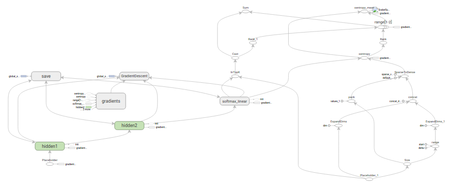

# deeplearningfun
Some deep learning fun stuff for fun ...

This repository will be horribly documented, and assumes that everyone has same host config inc.
the OS so if you want to be spoonfeeded, better go home and cry.

## Model summary visualization:

